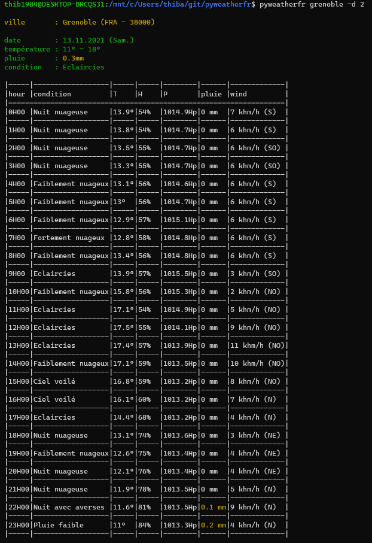

# :sunny: :umbrella: :cloud: pyweatherfr

pyweatherfr displays weather forecast for a given town in your terminal. It uses https://www.prevision-meteo.ch and https://geolocation-db.com/json

# 🚀 How to use **pyweatherfr**

pyweatherfr \[TOWN\]

example : ``pyweatherfr Grenoble`` to display weather forecast in town Grenoble

pyweatherfr \[TOWN\] -d [INT(0-4)]

example : ``pyweatherfr Grenoble`` to display hourly weather forecast for for the next day

## Other options

  - ``-h/--help``    show the help message and exit
  - ``-u/--update``  update pyweatherfr
  - ``-c/--condensate``  condensate output
  - ``-n/--nocolor``  disable colour in sysout
  - ``-v/--verbose``  verbose sysout

# Démo

)

)

# ⚙️ Install

See [this page](INSTALL.md)

# :construction_worker: Contribution

See [this page](CONTRIBUTING.md)

# :package: Changelog

See [this page](CHANGELOG.md)

# License

MIT License

Copyright (c) 2021 [thib1984](https://github.com/thib1984)

See [this page](LICENSE.txt) for details
