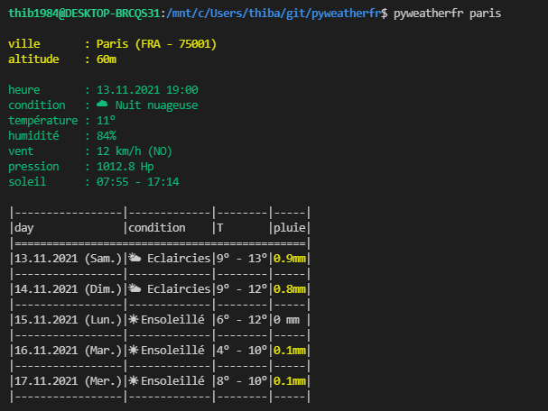
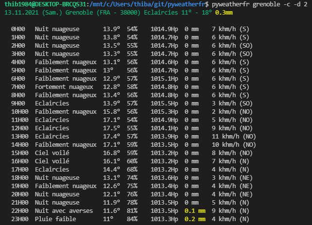

# :sunny: :umbrella: :cloud: pyweatherfr

pyweatherfr affiche les prévisions méteo pour les communes françaises dans votre terminal. Il utilise les API https://www.prevision-meteo.ch et https://geolocation-db.com/json

# 🚀 Comment utiliser **pyweatherfr**

pyweatherfr \[VILLE\]

exemple : ``pyweatherfr Grenoble`` affiche les prévisions météo pour Grenoble

pyweatherfr \[TOWN\] -d [INT(0-4)]

exemple : ``pyweatherfr Grenoble -d 1 `` affiche les prévisions météo détaillées pour Grenoble à J+1

pyweather -p \[CODE_POSTAL\]

exemple : ``pyweatherfr -p  38700 `` affiche les prévisions météo pour le code postal 38700

pyweather -g \[CODE_POSTAL\]

exemple : `` pyweatherfr -g 45 5 `` affiche les prévisions météo pour les coordonnées GPS (latitude : 45 et longitude : 5)

## Autres options

  - ``-h/--help``    montrer l'aide
  - ``-u/--update``  update pyweatherfr
  - ``-c/--condensate``  condense la sortie
  - ``-n/--nocolor``  désactive les couleurs et les emojis en sortie
  - ``-v/--verbose``  mode verbeux

# Démo

# ⚙️ Install

See [this page](INSTALL.md)

# :construction_worker: Contribution

See [this page](CONTRIBUTING.md)

# :package: Changelog

See [this page](CHANGELOG.md)

# License

MIT License

Copyright (c) 2021 [thib1984](https://github.com/thib1984)

See [this page](LICENSE.txt) for details
